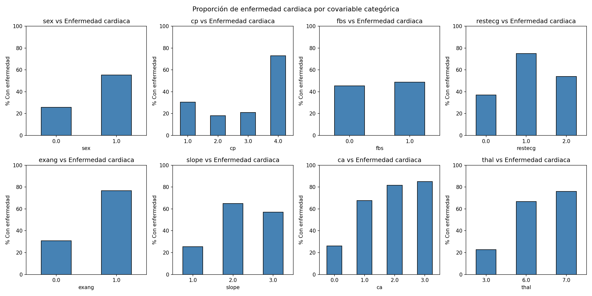
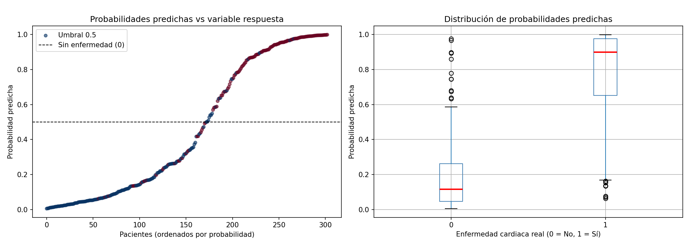
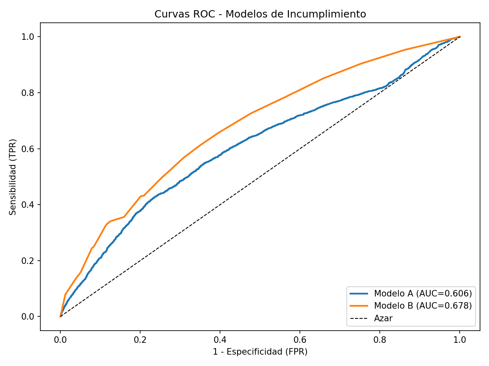
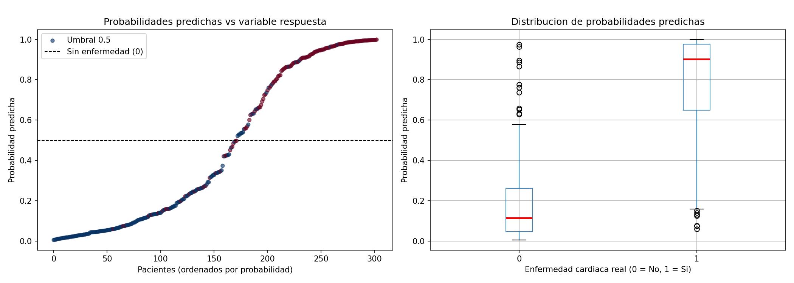

# Taller 3: análisis avanzado de datos

En este proyecto resolvemos los 4 problemas del taller #3. El primero es teórico y los siguientes son prácticos. Cada uno de los puntos prácticos tiene un archivo `.py` con su código implementado. A continuación, los pasos para la ejecución del código y el análisis y las respuestas de cada punto.

## Autores

| Nombre | GitHub |
|---|---|
| Stefany Mojica | [@stefymojica](https://github.com/stefymojica) |
| Juan Rodríguez | [@JuanSebastianrs](https://github.com/JuanSebastianrs) |
| Sara Castillejo Ditta | [@scastillejoditta](https://github.com/scastillejoditta) |

---

## Pasos para la ejecución

**Prerequisitos:**

- Python 3.9+
- `pip` o `pip3`

```bash
# Clonar repositorio
git clone https://github.com/stefymojica/caso-heart-disease.git

# Verificar que tienes la última versión
git fetch origin

# Crear entorno virtual
python -m venv venv

# Activar entorno virtual
source venv/bin/activate        # Linux/Mac
source venv/Scripts/activate    # Windows

# Instalar dependencias
pip install -r requirements.txt

# Ejecutar cada punto
python problema2.py
python problema3.py
python problema4.py
```

---

## PROBLEMA 1: Demostrar si las distribuciones Bernoulli, normal y Poisson pertenecen a la familia exponencial

Una distribución pertenece a la **familia exponencial** si su fmp/fdp puede escribirse como:

$$p(x|\theta) = h(x)\exp(\eta(\theta)\,t(x) - a(\theta))$$

Cada componente dentro de las distribuciones de esta familia tiene un rol conceptual claro:

| Componente | Nombre | ¿Qué hace? |
|---|---|---|
| $h(x)$ | Función base | Define el "soporte" natural de $x$, independiente del parámetro. |
| $\eta(\theta)$ | Parámetro natural | Transforma el parámetro original a un espacio más conveniente. |
| $t(x)$ | Estadístico suficiente | Resume toda la información de los datos sobre $\theta$. |
| $a(\theta)$ | Log-partición | Normaliza para que todo sume/integre 1. |

Para saber si las distribuciones mencionadas pertenecen a esta familia, basta con verificar si pueden o no reescribirse de la forma algebraica señalada. Veamos:

### Distribución Bernoulli

Se usa en la regresión logística. Sirve para modelar eventos binarios $x \in \{0, 1\}$.

**Forma estándar** de su Función de Masa de Probabilidad (fmp):

$$p(x|p) = p^x(1-p)^{1-x}$$

**Derivación:**

Aplicamos logaritmo y exponencial:

$$p(x|p) = \exp\left(x\log p + (1-x)\log(1-p)\right)$$

$$= \exp\left(x\log p - x\log(1-p) + \log(1-p)\right)$$

$$= \exp\left(x\log\frac{p}{1-p} + \log(1-p)\right)$$

**Identificación de componentes:**

| Componente | Expresión |
|---|---|
| $h(x)$ | $1$ |
| $\eta(\theta)$ | $\log\dfrac{p}{1-p}$ (log-odds) |
| $t(x)$ | $x$ |
| $a(\theta)$ | $-\log(1-p) = \log(1 + e^\eta)$ |

**Conclusión:** La Bernoulli pertenece a la familia exponencial. $\checkmark$

---

### Distribución Normal

Se usa en la regresión lineal. Asumimos $\sigma^2$ conocida, $\theta = \mu$.

**Forma estándar** de su Función de Densidad de Probabilidad (fdp):

$$p(x|\mu) = \frac{1}{\sqrt{2\pi\sigma^2}}\exp\left(-\frac{(x-\mu)^2}{2\sigma^2}\right)$$

**Derivación:** expandimos el cuadrado en el exponente:

$$-\frac{(x-\mu)^2}{2\sigma^2} = -\frac{x^2}{2\sigma^2} + \frac{\mu x}{\sigma^2} - \frac{\mu^2}{2\sigma^2}$$

Entonces:

$$p(x|\mu) = \underbrace{\frac{1}{\sqrt{2\pi\sigma^2}}\exp\left(-\frac{x^2}{2\sigma^2}\right)}_{h(x)} \cdot \exp\left(\frac{\mu}{\sigma^2}\cdot x - \frac{\mu^2}{2\sigma^2}\right)$$

**Identificación de componentes:**

| Componente | Expresión |
|---|---|
| $h(x)$ | $\dfrac{1}{\sqrt{2\pi\sigma^2}}\exp\!\left(-\dfrac{x^2}{2\sigma^2}\right)$ |
| $\eta(\theta)$ | $\dfrac{\mu}{\sigma^2}$ |
| $t(x)$ | $x$ |
| $a(\theta)$ | $\dfrac{\mu^2}{2\sigma^2}$ |

**Conclusión:** La Normal pertenece a la familia exponencial. $\checkmark$

---

### Distribución Poisson

Se usa en la regresión Poisson para conteos $x \in \{0, 1, 2, \ldots\}$.

**Forma estándar** de su Función de Masa de Probabilidad (fmp):

$$p(x|\lambda) = \frac{\lambda^x e^{-\lambda}}{x!}$$

**Derivación:**

$$p(x|\lambda) = \frac{1}{x!}\exp\left(x\log\lambda - \lambda\right)$$

**Identificación de componentes:**

| Componente | Expresión |
|---|---|
| $h(x)$ | $\dfrac{1}{x!}$ |
| $\eta(\theta)$ | $\log\lambda$ |
| $t(x)$ | $x$ |
| $a(\theta)$ | $\lambda$ |

Dado que el parámetro natural es $\eta = \log\lambda$, se tiene que $\lambda = e^\eta$, por lo que $a(\theta)$ puede expresarse en términos de $\eta$ como $a(\eta) = e^\eta$. Esto confirma que $a$ cumple su rol de log-partición: normaliza la distribución y, como se puede verificar, $\frac{da}{d\eta} = e^\eta = \lambda = \mathbb{E}[x]$.

**Conclusión:** La Poisson pertenece a la familia exponencial. $\checkmark$

---

### Resumen comparativo

| Distribución | $h(x)$ | $\eta(\theta)$ | $t(x)$ | $a(\theta)$ |
|---|---|---|---|---|
| Bernoulli | $1$ | $\log\frac{p}{1-p}$ | $x$ | $\log(1+e^\eta)$ |
| Normal ($\sigma^2$ fija) | $\frac{1}{\sqrt{2\pi\sigma^2}}e^{-x^2/2\sigma^2}$ | $\mu/\sigma^2$ | $x$ | $\mu^2/2\sigma^2$ |
| Poisson | $1/x!$ | $\log\lambda$ | $x$ | $e^\eta$ |

Las tres distribuciones admiten la forma canónica $h(x)\exp(\eta(\theta)t(x) - a(\theta))$, por lo tanto **pertenecen a la familia exponencial de distribuciones**, que es el fundamento de los Modelos Lineales Generalizados (GLM):

GLM = familia exponencial + función de enlace + predictor lineal
         (distribución)      (conecta E[y] con Xβ)    (Xβ)

En los tres casos analizados, $t(x) = x$ (el dato mismo es el estadístico suficiente). Además, el parámetro natural $\eta$ de cada distribución corresponde exactamente a la función de enlace canónica que se usa en su GLM respectivo: logit para la Bernoulli, identidad para la Normal y log para la Poisson.

---

## PROBLEMA 2: Predicción de la enfermedad del corazón

Construir un modelo de regresión logístico con función de enlace logit, tomando como respuesta la presencia de la enfermedad cardiaca. Usar las demás variables como explicativas. [Dataset de la Universidad de California Irvine](http://archive.ics.uci.edu/ml/machine-learning-databases/heart-disease/processed.cleveland.data).

### 1. Imputación

El dataset original tiene 303 observaciones y 14 columnas. 2 de ellas presentan valores faltantes: `ca`, con 4; `thal`, con 2. En ambos casos se imputó con la mediana de cada variable:

- `ca` imputada con mediana = 0.0
- `thal` imputada con mediana = 3.0

### 2. Distribuciones bivariadas — covariables categóricas vs variable respuesta

Se analizó la proporción de enfermedad cardiaca (`heart_disease = 1`) dentro de cada categoría de las 8 covariables categóricas del dataset.



En general, las variables más prometedoras para el modelo logístico parecen ser `cp`, `exang`, `ca` y `thal`, dado que muestran diferencias más pronunciadas entre categorías respecto a la presencia de enfermedad.

#### Tablas de contingencia (% con enfermedad cardiaca)

| Variable | Categorías | % con enfermedad por categoría |
|---|---|---|
| `sex` | 0 = Mujer, 1 = Hombre | Mujer: 25.8% / Hombre: 55.3% |
| `cp` | 1–4 (tipo de dolor) | 1: 30.4% / 2: 18.0% / 3: 20.9% / **4: 72.9%** |
| `fbs` | 0 = ≤120 mg/dl, 1 = >120 mg/dl | 0: 45.3% / 1: 48.9% |
| `restecg` | 0, 1, 2 | 0: 37.1% / **1: 75.0%** / 2: 54.1% |
| `exang` | 0 = No, 1 = Sí | 0: 30.9% / 1: 76.8% |
| `slope` | 1, 2, 3 | 1: 25.4% / 2: 65.0% / 3: 57.1% |
| `ca` | 0–3 (vasos coloreados) | 0: 26.1% / 1: 67.7% / 2: 81.6% / 3: 85.0% |
| `thal` | 3, 6, 7 | 3: 22.6% / 6: 66.7% / **7: 76.1%** |

#### ¿Se observa algún inconveniente?

**Sí. Hay dos problemas concretos:**

##### Problema 1: Categoría con muy pocos datos — `restecg = 1`

La categoría `restecg = 1` (hipertrofia ventricular izquierda probable) tiene **solo 4 observaciones** en todo el dataset (1 sin enfermedad, 3 con enfermedad). Esto genera:

- Estimaciones del coeficiente $\beta$ inestables con errores estándar muy grandes.
- El 75% reportado no es representativo de la población real; es producto del tamaño muestral mínimo.
- En el modelo multivariado, `restecg` resulta **no significativo** (p = 0.198), en parte por esta razón.

> **Consecuencia:** en un análisis riguroso se debería considerar colapsar `restecg = 0` y `restecg = 1` en una sola categoría, o al menos reportar la inestabilidad del estimador.

##### Problema 2: `fbs` no discrimina la variable respuesta

La glucemia en ayunas (`fbs`) muestra porcentajes de enfermedad casi idénticos entre sus dos categorías:

- `fbs = 0` (glucemia normal): **45.3%** con enfermedad
- `fbs = 1` (glucemia alta): **48.9%** con enfermedad

La diferencia es de apenas **3.6 puntos porcentuales**, lo que indica que `fbs` prácticamente no aporta información para distinguir pacientes con y sin enfermedad cardiaca. Esto se confirma en el modelo bivariado (Paso 3): OR = 1.15, $\hat{\beta}_1 = 0.1421$; y en el modelo multivariado (Paso 4): p-valor = 0.1422 → **no significativa** por test de Wald.

> **Consecuencia:** `fbs` es la variable con menor poder explicativo del conjunto. Incluirla no mejora la predicción y puede aumentar la varianza de otros estimadores.

#### Resumen de inconvenientes

| Variable | Inconveniente | Efecto en el modelo |
|---|---|---|
| `restecg` | Categoría `= 1` con solo 4 observaciones | Estimador inestable, p = 0.198 |
| `fbs` | No discrimina la respuesta (Δ% = 3.6) | OR ≈ 1, p = 0.142, no significativa |

### 3. Modelo bivariado

Para verificar la implementación del GLM, se estimaron manualmente los parámetros del modelo bivariado con la variable `fbs` (glucemia en ayunas) y se compararon con los obtenidos mediante `statsmodels`.

A partir de la tabla de contingencia, se calcularon las proporciones de enfermedad cardiaca para cada categoría: $\hat{\pi}(\text{fbs}=0) = 0.4535$ y $\hat{\pi}(\text{fbs}=1) = 0.4889$. De estas proporciones se derivaron los odds correspondientes (0.8298 y 0.9565), lo que permite obtener los coeficientes como $\hat{\beta}_0 = \log(\text{odds}_0) = -0.1866$ y $\hat{\beta}_1 = \log(OR) = 0.1421$ (OR = 1.1527).

Ambos valores coinciden exactamente con los entregados por el GLM, lo que confirma que la estimación por máxima verosimilitud reproduce el cálculo manual. Nótese que el OR cercano a 1 y el coeficiente $\hat{\beta}_1$ pequeño son consistentes con lo observado en el análisis bivariado: `fbs` muestra escasa capacidad discriminativa respecto a la presencia de enfermedad cardiaca.

### 4. Modelo multivariado

Se ajustó un modelo de regresión logística multivariado (GLM con familia Binomial y función de enlace logit) sobre las 13 covariables disponibles, utilizando 303 observaciones. El modelo alcanzó un Pseudo R² de Cox-Snell de 0.4982, lo que indica una capacidad explicativa moderada-alta.

Mediante el test de Wald (α = 0.05), se identificaron **8 variables estadísticamente significativas**: `sex` (OR = 3.94), `cp` (OR = 1.84), `trestbps` (OR = 1.02), `thalach` (OR = 0.98), `exang` (OR = 2.81), `ca` (OR = 3.45) y `thal` (OR = 1.38), además de la constante.

Las variables con mayor efecto sobre la probabilidad de enfermedad cardiaca son `ca` y `sex`: cada vaso adicional coloreado por fluoroscopía multiplica las chances de enfermedad por 3.45, y los hombres presentan ~4 veces más riesgo que las mujeres. Adicionalmente, tener angina inducida por ejercicio (`exang`) casi triplica las chances de enfermedad cardiaca (OR = 2.81).

Por otro lado, `age`, `chol`, `fbs`, `restecg`, `oldpeak` y `slope` no resultaron significativas en presencia de las demás covariables, lo que sugiere que su efecto individual queda absorbido por variables más informativas dentro del modelo conjunto.

### 5. Probabilidades predichas y conclusión

El modelo de regresión logística multivariado produce probabilidades predichas que se evaluaron visualmente y con métricas de discriminación.



| Métrica | Valor |
|---|---|
| **AUC-ROC** | **0.9240** |
| **Accuracy** (umbral 0.5) | **84.2%** |

#### ¿Describe el modelo la presencia de enfermedad cardiaca?

1. **AUC-ROC = 0.92:** Un AUC superior a 0.90 indica excelente poder discriminativo. El modelo separa correctamente a los pacientes con y sin enfermedad cardiaca en el 92% de los pares posibles.

2. **Separación visual clara:** El boxplot de probabilidades predichas muestra medianas claramente separadas entre los dos grupos: pacientes sin enfermedad (Y=0) concentrados en probabilidades bajas (< 0.5), y pacientes con enfermedad (Y=1) concentrados en probabilidades altas (> 0.5).

3. **Accuracy = 84.2%:** Con un umbral simple de 0.5, el modelo clasifica correctamente a 8 de cada 10 pacientes.

4. **Variables con mayor aporte predictivo** (significativas por Wald, p < 0.05): `ca` (OR = 3.45), `sex` (OR = 3.94), `cp` (OR = 1.84), `exang` (OR = 2.81) y `thal` (OR = 1.38).

El modelo logístico multivariado **sí describe adecuadamente** la presencia de enfermedad cardiaca. Con un AUC de 0.92 y accuracy de 84%, el modelo tiene un desempeño sólido sobre los datos de entrenamiento. Las probabilidades predichas se alinean con la variable respuesta real, lo que confirma que las covariables seleccionadas capturan los factores de riesgo más relevantes para la enfermedad cardiaca en esta población.

---

## PROBLEMA 3: Comparación de poder predictivo entre modelos de score

Se comparó el poder discriminativo de dos modelos de score logístico (`ScoreLogisticoA` y `ScoreLogisticoB`) para predecir incumplimiento sobre el conjunto de datos AAD-taller03.xlsx, de 9.080 observaciones, con una prevalencia de incumplimiento del 50.99%.

**Metodología.** Se midió la discriminación de cada modelo mediante el área bajo la curva ROC (AUC). Antes de comparar, se verificó la orientación de cada score: `ScoreLogisticoB` venía en sentido inverso (AUC directo = 0.3221), por lo que se trabajó con `-score` para que un valor alto correspondiera a mayor riesgo de incumplimiento (AUC corregido = 0.6779). La incertidumbre de cada AUC se cuantificó con intervalos de confianza al 95% por bootstrap (2.000 remuestras), y la comparación entre modelos se realizó mediante un test bootstrap pareado sobre el Delta AUC (A − B), con corrección de continuidad para el p-valor bilateral.

**Resultados.**

| Modelo | AUC | IC 95% |
|---|---|---|
| Modelo A | 0.6060 | [0.5947, 0.6170] |
| Modelo B | 0.6779 | [0.6663, 0.6886] |
| Delta (A − B) | −0.0718 | [−0.0881, −0.0558] |

La diferencia es estadísticamente significativa (p < 0.001), por lo que se concluye que el **Modelo B presenta mayor poder predictivo**. La curva ROC confirma visualmente este resultado:



La curva naranja (Modelo B) domina consistentemente a la curva azul (Modelo A) a lo largo de todos los umbrales de clasificación.

---

## PROBLEMA 4: Enfermedad del corazón con imputación EM (IterativeImputer)

Se replicó el flujo del Problema 2 reemplazando únicamente la estrategia de imputación: en lugar de imputar por la mediana columna a columna, se utilizó `IterativeImputer` de scikit-learn, que modela cada variable con datos faltantes en función de las demás, aproximando el enfoque EM para datos incompletos.

**Estimación manual vs. GLM (variable `fbs`).** Los resultados del modelo bivariado con `fbs` son idénticos a los del Problema 2 ($\hat{\beta}_0 = -0.1866$, $\hat{\beta}_1 = 0.1421$, OR = 1.1527), lo cual es esperado dado que `fbs` no tenía valores faltantes y por tanto la imputación no la afecta.

**Modelo multivariado.** El modelo GLM con las 13 covariables sobre 303 observaciones arrojó un Pseudo R² de Cox-Snell de 0.4992, prácticamente idéntico al obtenido con imputación por mediana (0.4982). Las variables significativas al 5% son las mismas en ambos enfoques —`sex`, `cp`, `trestbps`, `exang`, `ca` y `thal`— con coeficientes y odds ratios muy similares. La única diferencia marginal es que `thalach` pierde significancia (p = 0.052 vs. 0.049), quedando justo en el límite. Esto sugiere que el método de imputación tiene un impacto mínimo sobre las conclusiones del modelo en este dataset, probablemente porque la proporción de datos faltantes era baja.



**Métricas predictivas.** El modelo con imputación EM alcanza un AUC-ROC de 0.9245 y una accuracy de 0.8416 (umbral 0.5), prácticamente idénticos a los del Problema 2 (AUC = 0.9240, accuracy = 84.2%). Esto confirma que el modelo logístico multivariado tiene un poder predictivo sólido independientemente del método de imputación empleado.
